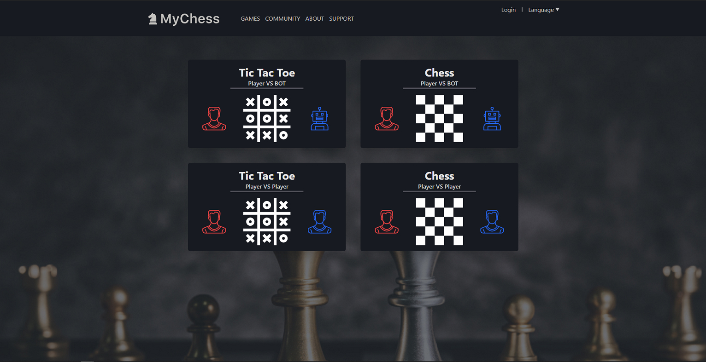

## [Live Demo](https://mychess.website) - [Live Api Document]() - [Live Test Coverage Result]()

## What is MyChess?

My chess is an online web games allow people can play chess or tic tac toe and share their happiness across the world.
This website is inspired by [Chess.com](https://www.chess.com/) and [Steam](https://store.steampowered.com).

## Technology

- Frontend
     - NextJS - Server side Rendering
     - React-Hook-Form - Flexible and extensible forms
     - Tailwind - Styling
- Backend
     - NestJS - Server core
     - Typeorm + Mysql2 + Redis - Database
     - Socket.io - Real-time connection
     - Swagger - Documentation
     - Joi + Our Joi package extensions - validation data
     - Sendgrid - Email service
     - Twilio - SMS service
     - AWS S3 - Storage

## Team Member

- Cao Chí Hải - Backend + Tester + Document
- Trương Bĩnh Tân - Backend + Tester + Document
- Phạm Vĩnh Nhân - Full-Stack + Planner

## How to run?

This app is required a complex configuration to run, In case you need to run and build this application please contact us for our support.

## Example

## Bug Report

Feel free to create an issue request anytime we will check it out and fix it as soon as possible.

## Reference

- [Steam](https://steampowered.com/) - UI and UX
- [Chess.com](https://www.chess.com/) - Tic-Tac-Toe Bot and Chess Bot
- [Wiki](https://en.wikipedia.org/wiki/Chess) - Rule for chess
